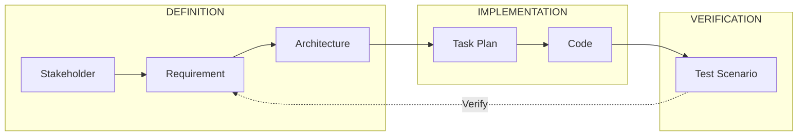

# SpecLoom 🧵
> **The Anti-Chaos Engine for AI-Driven Development.**

[](https://badge.fury.io/js/specloom)
[](https://opensource.org/licenses/MIT)

SpecLoom is a **Specification-Driven Development (SDD)** engine designed to tame the chaos of Large Language Models. It enforces a strict **V-Model**, ensuring that every line of code generated by an AI is explicitly traceable to a Requirement, which is traceable to a Stakeholder Need.

**Stop "Vibe Coding." Start Engineering.**

---

## 🧠 Why SpecLoom?

AI Agents are brilliant but forgetful. They excel at writing code but fail at maintaining **Systemic Integrity** over time. They suffer from:
*   **Context Drift:** Forgetting the original constraints after 50 messages.
*   **Hallucination:** Inventing APIs that don't exist.
*   **Self-Approval:** verifying their own broken code.

SpecLoom solves this by acting as an **External Cortex**—a rigid, graph-based memory that enforces the rules of software engineering.

| Feature | ⚡ "Vibe Coding" (Raw LLM) | 🤖 Agent Frameworks | 🧵 SpecLoom |
| :--- | :--- | :--- | :--- |
| **Primary Goal** | Speed & Demos | Collaboration & Personas | **Integrity & Correctness** |
| **Context** | Chat History (Ephemeral) | Chat + Files | **Graph Database (Persistent)** |
| **Validation** | "Looks good to me" | Peer Review (AI-to-AI) | **Schema & Traceability Gates** |
| **Structure** | None | Agile / Squads | **V-Model (IEEE 12207)** |

---

## 🚀 The V-Model Workflow

SpecLoom forces a "Left-to-Right" execution flow. You cannot implement what you haven't specified.



---

## ⚡ Quick Start

### 1. Installation
```bash
npm install -g specloom
```

### 2. Initialize
```bash
mkdir my-new-app && cd my-new-app
loom init --greenfield
```

### 3. Follow the Guardian
SpecLoom tells you (or your Agent) exactly what to do next. It effectively "prompts" the user/agent with the next logical step in the V-Model.

```bash
loom next
```
*Output:*
```text
>>> NEXT OBJECTIVE: TASK-001 <<<
Title: Define Product Context
Type: Definition
Instruction: Create .spec/data/01_context/product_context.json
```

### 4. Implement & Verify
```bash
# 1. Start a task (Locks context & tracks identity)
loom start TASK-031

# 2. Get the context bundle (Requirements + Code)
loom context TASK-031

# 3. ... (AI execute instructions) ...

# 4. Complete & Request Review
loom complete TASK-031
```

---

## 🔌 AI Integration (MCP)

SpecLoom implements the **Model Context Protocol (MCP)**. It is designed to be the "Brain" for agents like **Claude Desktop**, **Cursor**, **Windsurf**, or **Cline**.

Add to your MCP Config:
```json
{
  "mcpServers": {
    "specloom": {
      "command": "loom-server"
    }
  }
}
```

### Tools Exposed to AI:
*   `loom_next`: The "What should I do?" tool.
*   `loom_context`: Intelligent context slicing (avoids window overflow).
*   `loom_validate`: Checks for broken traces or orphans.
*   `loom_start` / `loom_complete`: Lifecycle management.

---

## 🛡️ Key Features

### 🔒 The "Four-Eyes" Principle
SpecLoom enforces identity separation. The session that **implements** a task cannot **approve** it.
*   `loom start` records the implementer's session ID.
*   `loom approve` fails if called by the same session.

### 🕸️ Graph-Based Traceability
Every artifact is a node in a local SQLite graph database (`.spec/graph.db`).
*   **Impact Analysis:** `loom impact FR-001` tells you exactly which files and tests will break if you change a requirement.
*   **Orphan Detection:** `loom validate` ensures no code exists without a parent requirement.

### 📄 IEEE-Standard Docs
Your spec isn't just JSON. SpecLoom renders it into human-readable Markdown following standard templates.
*   **SRS** (Software Requirements Specification)
*   **SDD** (Software Design Document)

---

## 🤝 Contributing

See [CONTRIBUTING.md](CONTRIBUTING.md) for developer guides.

**License:** MIT
