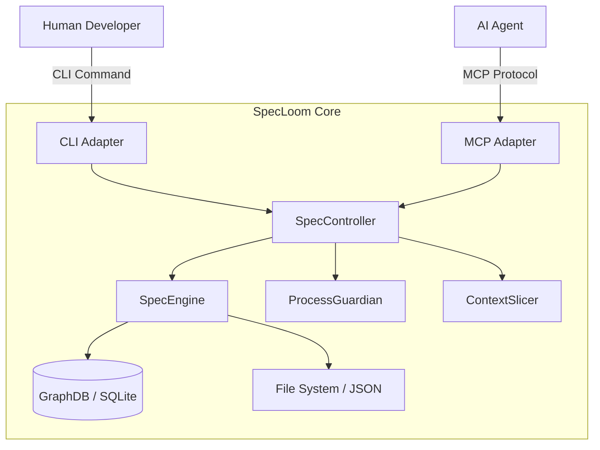
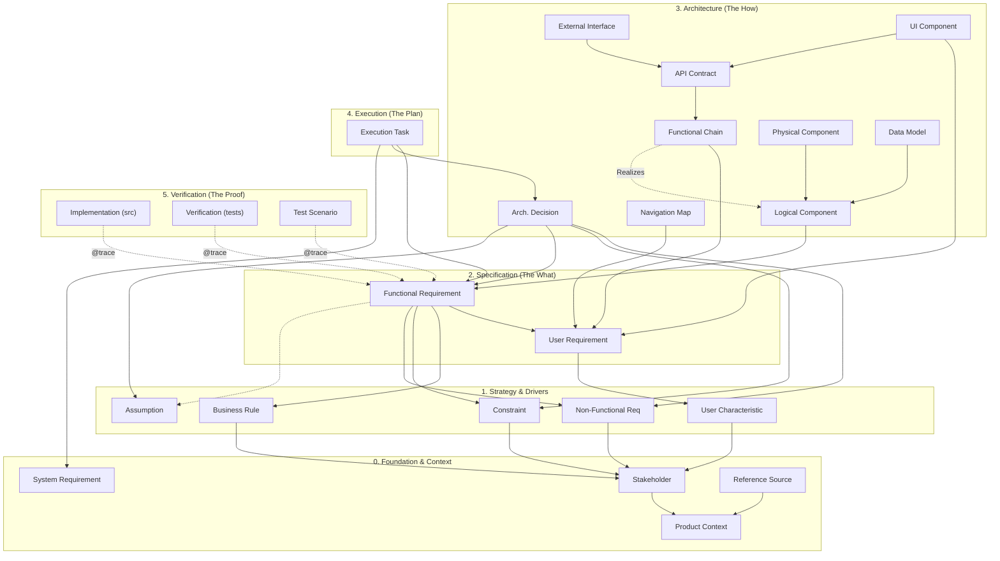

# SpecLoom Architecture

## 1. Overview

SpecLoom operates as a hybrid system: part **CLI tool** for human developers and part **MCP Server** for AI agents. It serves as a "Compliance & Traceability Layer" that sits between the intent (Requirements) and the realization (Code).

### System Context

## 2. Core Components

### 2.1 The Traceability Graph

At the heart of SpecLoom is a **Directed Acyclic Graph (DAG)** that maps every artifact in the software lifecycle.

* **Storage:** The source of truth is a set of human-readable JSON files in `.spec/data/`.
* **Indexing:** For performance, these files are indexed into a local SQLite database (`.spec/graph.db`).
* **Nodes:** Every artifact (User Story, API Endpoint, Test Case, Task) is a node.
* **Edges:** Relationships (traces) connect nodes (e.g., `FR-001` *satisfies* `UR-005`).

### 2.2 The Dual Interface Strategy

To support the HADD (Human-Augmented Design & Development) framework, SpecLoom exposes identical functionality through two interfaces:

1. **CLI (Commander.js):** Standard unix-style commands for CI/CD and human usage.
2. **MCP Server (Model Context Protocol):** A JSON-RPC over Stdio interface that allows AI Agents (Cursor, Windsurf, Claude) to query the graph and perform actions as tools.

### 2.3 Directory Structure (The V-Model Spine)

The architecture enforces a physical separation of concerns mapping to the V-Model:

| Directory | Layer | Purpose |
| :--- | :--- | :--- |
| `.spec/data/00_infastructure` | **Foundation** | Registry, Schemas, Protocols |
| `.spec/data/01_context` | **Context** | Product Scope, Stakeholders |
| `.spec/data/02_pivots` | **Strategy** | Assumptions, Risk Management |
| `.spec/data/03_users` | **Intent** | User Personas, User Requirements |
| `.spec/data/04_system` | **Specification** | Functional Requirements, Constraints |
| `.spec/data/05_design` | **Architecture** | API Contracts, Data Models, ADRs |
| `.spec/data/06_execution` | **Plan** | Tasks, Execution Sessions |

### 3. The Artifact Traceability Map

This diagram defines the strict dependency graph for SpecLoom artifacts.

### Traceability Matrix

| Artifact Type | Traces To (Parents) | Driven By (Children) |
| :--- | :--- | :--- |
| **System Req (`SYS`)** | *None (Root)* | Process Tasks |
| **Stakeholder (`STK`)** | Product Context | BR, NFR, CON, UCH |
| **User Char (`UCH`)** | Stakeholder | User Requirements |
| **User Req (`UR`)** | User Char | Functional Reqs, FCHAIN, NAV, UIC |
| **Business Rule (`BR`)** | Stakeholder | Functional Reqs |
| **Constraint (`CON`)** | Stakeholder | Functional Reqs, ADRs |
| **Non-Functional (`NFR`)** | Stakeholder | Functional Reqs, ADRs |
| **Assumption (`ASM`)** | *None (Root)* | FRs, ADRs |
| **Functional Req (`FR`)** | UR, BR, NFR, CON, ASM | LCOMP, Tasks, Code, Tests |
| **Logical Component (`LCOMP`)** | FR | PCOMP, FCHAIN, DATA |
| **Physical Component (`PCOMP`)** | LCOMP | Tasks |
| **Functional Chain (`FCHAIN`)** | UR, LCOMP | API |
| **API Contract (`API`)** | FCHAIN | EXT, UIC |
| **Data Model (`DATA`)** | LCOMP | Tasks |
| **Navigation Map (`NAV`)** | UR | Tasks |
| **UI Component (`UIC`)** | UR, API | Tasks |
| **External Interface (`EXT`)**| API | Tasks |
| **ADR** | FR, NFR, CON, ASM | Tasks, LCOMP/PCOMP |
| **Execution Task** | FR, ADR, SYS | Sessions, Code Changes |

## 4. Key Subsystems

### 4.1 SpecEngine

The central controller that orchestrates all read/write operations.

* **Responsibilities:**
  * Syncing file system state to the GraphDB.
  * Enforcing unique IDs and schema validation.
  * Managing Task locks.

### 4.2 Context Slicer

A specialized service designed for LLM context window optimization.

* **Problem:** Sending the entire specification to an AI agent is too expensive/large.
* **Solution:** The Slicer retrieves only the relevant subgraph around a focus node (e.g., "Get `TASK-001` and its immediate dependencies").

### 4.3 Process Guardian

Enforces the rules of the methodology.

* **Gatekeeping:** Prevents moving to Implementation if Design is missing.
* **Identity Checks:** Enforces the "Four-Eyes Principle" (Implementer != Reviewer).

## 5. Architectural Decisions (ADRs)

* **ADR-001: Embedded Graph Database:** We use `better-sqlite3` for complex queries while keeping JSON as the git-friendly storage format.
* **ADR-002: Dual-Interface Core:** Core logic is isolated from the presentation layer to ensure parity between CLI and MCP.
* **ADR-003: Optimistic Locking:** We use file-based locks to handle concurrency between multiple agents without a central server.
