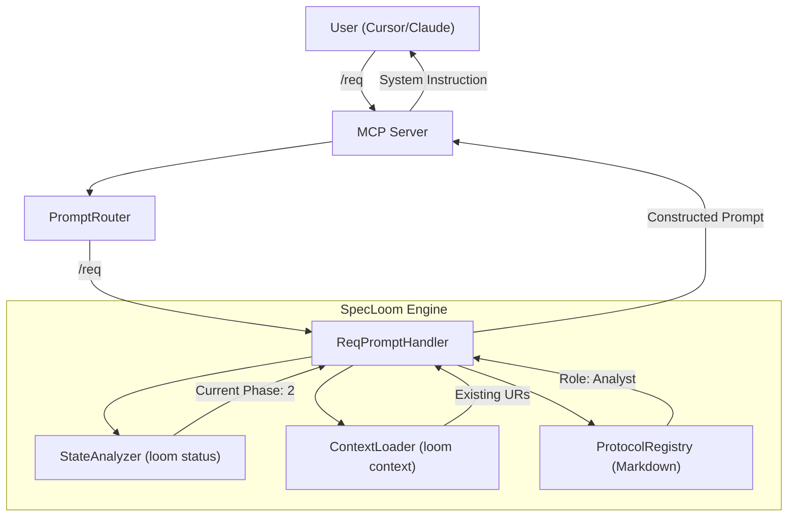

# SpecLoom MCP UX Redesign: The "Intelligent Guide" Workflow

## 1. Problem Statement

### The "Agent-Pull" Friction
Currently, SpecLoom relies on an "Agent-Pull" model where the LLM must proactively discover and read protocols (`read_file .spec/core/protocol/...`) and context (`loom context ...`). This has critical drawbacks:
*   **Latency:** Multiple round-trips to load rules before doing work.
*   **Token Waste:** Repeatedly reading static instructions.
*   **Fragility:** Agents often "forget" or skip reading critical protocols, leading to "vibe coding" (untraceable changes).
*   **Cognitive Load:** The user must know the exact CLI command sequence to guide the agent.

## 2. The Solution: "User-Push" via MCP Prompts

We shift to a "User-Push" model using **MCP Prompts** (Slash Commands).
Instead of the agent *asking* for rules, the user *injects* the correct "Persona" and "Protocol" directly into the context window at the start of the turn.

### The "Intelligent Guide" Concept
A Slash Command (e.g., `/req`) is not just a text snippet. It is a dynamic function that:
1.  **Analyzes State:** Checks the project phase (Genesis, Spec, Arch, etc.).
2.  **Validates Pre-requisites:** Ensures dependencies exist (e.g., "Cannot define `FR` without `UR`").
3.  **Constructs Context:** Assembles a targeted System Prompt + relevant Context Data.
4.  **Returns Instruction:** "You are now the Requirement Engineer. The user wants X. You must enforce Protocol Y."

---

## 3. The Command Suite (6+4 Strategy)

We define **10 Standard Prompts** that cover the entire V-Model lifecycle.

### A. Core Workflow (The V-Model Guides)

| Command | Phase | Role | Dynamic Logic (State-Aware) |
| :--- | :--- | :--- | :--- |
| **`/init`** | 1 (Context) | Product Manager | Checks if `product_context` exists. If missing, guides user to define Scope & Stakeholders. If present, shows summary. |
| **`/req`** | 2-4 (Spec) | Business Analyst | Checks `UCH` coverage. Maps `UR` -> `FR`. Identifies Orphans. Enforces "Problem before Solution." |
| **`/arch`** | 5 (Design) | System Architect | Checks `FR` coverage. Enforces "Views First" rule. Mandates `ADR` for decision points. |
| **`/plan`** | 6a (Planning) | Technical Lead | Breaks `FR`/`ADR` into `TASK`s. Checks dependencies. Enforces `Definition of Done` and `Traceability`. |
| **`/impl`** | 6b (Execution)| Lead Developer | Reads `loom next` (Active/Next Task). Ingests the **Context Bundle** for that task. Returns "Coding Agent" instructions. |
| **`/verify`**| 6c (Quality) | QA Engineer | Reviews implementation against `FR`/`ADR`. Generates `SCN` (Scenarios). Handles **Defect Tasks**. |

### B. Utility Accessors (Direct Retrieval)

| Command | Purpose | Output Content |
| :--- | :--- | :--- |
| **`/context [ID]`** | Data Fetch | Returns the full JSON content + Up/Down traces for the requested IDs. |
| **`/status`** | Health Check | Runs `loom status`. Returns "Phase: X. Open Tasks: Y. Gaps: Z." |
| **`/info`** | System Meta | Returns SpecLoom Manual, Master Protocols, and Agent Operating Instructions. |
| **`/project`** | Project Meta | Summarizes `product_context`, `stakeholders`, and high-level `BR`s (The "Project Knowledge"). |

---

## 4. Technical Architecture

### Component Diagram

### Protocol Decomposition (Micro-Protocols)
The monolithic `master_agent_system_prompt.md` will be split into specialized "Micro-Protocols" stored in `src/core/prompts/standard_procedures/`:
*   `procedure_init.md`
*   `procedure_req.md`
*   `procedure_arch.md`
*   `procedure_plan.md`
*   `procedure_impl.md`
*   `procedure_verify.md`

This ensures the agent only loads the rules relevant to the current task (Context Efficiency).

---

## 5. Migration Strategy

1.  **Refactor Protocols:** Split the master prompt.
2.  **Implement Engine Logic:** Create `PromptFactory` and `StateAnalyzer`.
3.  **Update MCP Adapter:** Map slash commands to the new factory.
4.  **Documentation:** Update `README.md` and `CLI_HELP.md` to feature the new commands as the primary interface.
