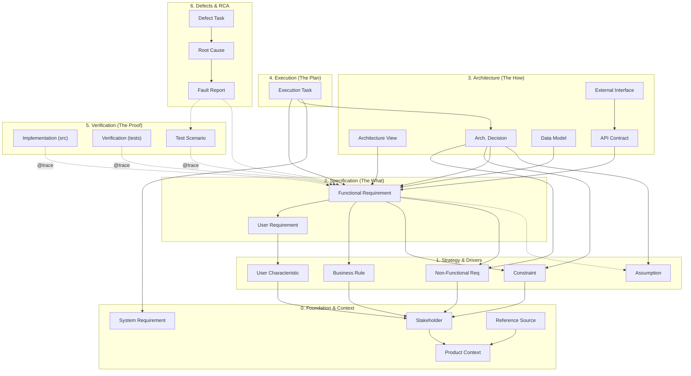

# SpecLoom Traceability Map (The Chain of Change)

This document defines the strict dependency graph for SpecLoom artifacts. It enforces the separation between **Governance** (Stakeholders) and **Usage** (Users).

## 1. The Dependency Graph

The arrows ($
ightarrow$) represent "Traces To" (Depends On). If a parent node changes, all children are impacted.

### 3. The Artifact Traceability Map

This diagram defines the strict dependency graph for SpecLoom artifacts.

### Traceability Matrix

| Artifact Type | Traces To (Parents) | Driven By (Children) |
| :--- | :--- | :--- |
| **System Req (`SYS`)** | *None (Root)* | Process Tasks |
| **Stakeholder (`STK`)** | Product Context | BR, NFR, CON, UCH |
| **User Char (`UCH`)** | Stakeholder | User Requirements |
| **User Req (`UR`)** | User Char | Functional Reqs |
| **Business Rule (`BR`)** | Stakeholder | Functional Reqs |
| **Constraint (`CON`)** | Stakeholder | Functional Reqs, ADRs |
| **Non-Functional (`NFR`)**| Stakeholder | Functional Reqs, ADRs |
| **Assumption (`ASM`)** | *None (Root)* | FRs, ADRs |
| **Functional Req (`FR`)** | UR, BR, NFR, CON, ASM | Architecture, Tasks, Code, Tests |
| **ADR** | FR, NFR, CON, ASM | Tasks, Architecture Views |
| **Execution Task** | FR, ADR, SYS | Sessions, Code Changes |
| **Fault Report (`FRT`)** | SCN, FR | Root Cause (`RCA`) |
| **Root Cause (`RCA`)** | FRT | Defect Resolution Tasks |

## 2. Definitions & Rules

### A. Stakeholder vs. User
*   **Stakeholder (`STK`)**: An entity that has an interest in the project but does not necessarily *use* the system (e.g., CTO, Regulator, Buyer).
    *   *Primary Output:* `Business Rules`, `NFRs`, `Constraints`.
*   **User Characteristic (`UCH`)**: A distinct persona or actor that interacts with the system (e.g., "Junior Developer", "Admin").
    *   *Primary Output:* `User Requirements` (User Stories).

### B. The Two Paths to a Feature (`FR`)
A Functional Requirement (`FR`) can exist for two reasons:
1.  **The Usage Path:** A User (`UCH`) has a specific Need (`UR`).
    *   *Example:* "As a Dev (`UCH`), I want to see a graph (`UR`), so the system must render nodes (`FR`)."
2.  **The Governance Path:** A Stakeholder (`STK`) enforces a Rule (`BR`).
    *   *Example:* "The CTO (`STK`) mandates GDPR (`BR`), so the system must encrypt logs (`FR`)."

### C. Validation Triangle
A Feature is **Complete** only when:
1.  **Definition:** The `FR` exists and traces to a `UR` or `BR`.
2.  **Implementation:** Code exists with `@trace FR-XXX`.
3.  **Verification:** A Test/Scenario exists with `@trace FR-XXX` and `@trace UR-XXX`
